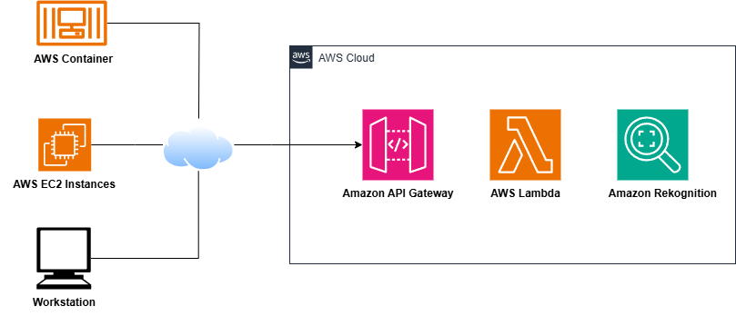

**Project: Implemented an image analysis solution with Terraform to identify friendly images.**

**Overview:** Demonstrated an end-to-end deployment of Amazon Recognition using AWS Lambda and Terraform for fully automated, serverless infrastructure management.

Deployment Steps:

1. **IAM Configuration:**
   - Created an IAM user with programmatic access to securely interact with AWS services through the API.

2. **Amazon API Gateway:**
   - Configured API endpoints to expose and manage core application services.

3. **AWS Lambda:**
   - Implemented a serverless function leveraging AWS-managed provisioning and compute resources.

4. **Amazon Machine Learning:**
   - Leveraged Amazon Recognition to identify and interpret facial expressions.

5. **Terraform (IaC):**
   - Utilized Infrastructure as Code (IaC) to automate the deployment process.

6. **Postman:**
   - Used to test and interact with APIs by sending requests to the server and analyzing the responses.

Repository: The reference diagram and Terraform file for this project are available in the GitHub repository. Please refer to the repository for detailed instructions on deploying the stack.

Conclusion: By deploying the Terraform file, you can successfully launch a serverless application.
